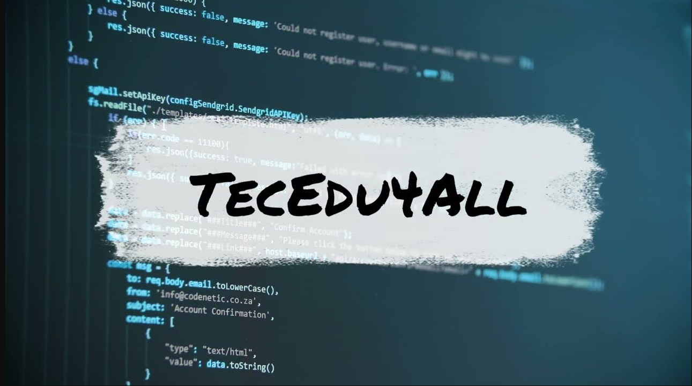

# Criando um Projeto do Zero com TypeORM, NodeJS, Express e MySQL

https://www.youtube.com/watch?v=c74zNWoCJiA&ab_channel=TecEdu4All

> Espero que curtam mais este curso e não esqueçam de curtir e se inscrever no canal, que mensalmente teremos novos cursos! =D

Project --> **Backend project with user entities**  
Channel --> **TecEdu4All 1,26 mil inscritos**  
Date Created --> **4 de fev. de 2023**

### Observations

-  created with typeORM
-  cors
-  express
-  mysql12
-  typescript

### Components

-  server start file
-  database-source
-  migrations
-  app folder structure
   -  controller
      -  routes
   -  entities
   -  interfaces
   -  repositories

### Tags

#nodejs #mysql #typescript #typeorm #express #tutorial

### Codigo no GitHub do projeto

https://github.com/nunesfb/project_typeorm_mysql_nodejs/tree/main

### Instalação e execução

1. Faça um clone desse repositório;
2. Rode o comando npm i
3. Configure os dados de conexão no banco no arquivo data-source.ts
4. Rode o comando npm run dev:server
